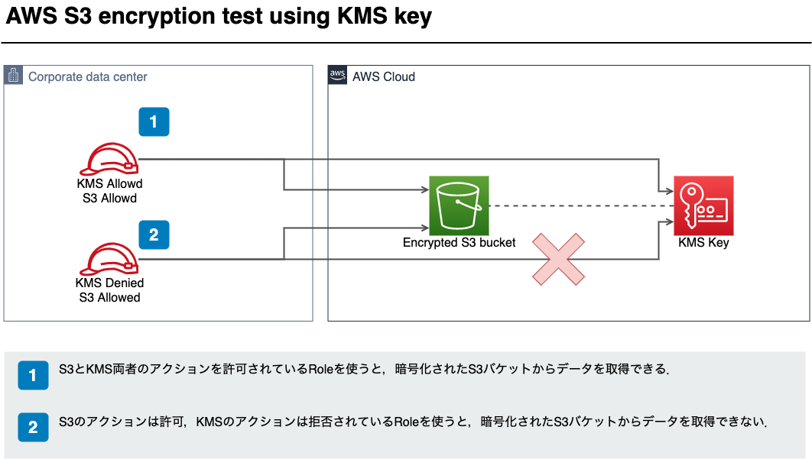

# AWS S3 encryption test using KMS key



## アクセス可能なIAM Policyを用いた場合

### AWS CLIでファイル取得した結果
```sh
$ aws s3 cp s3://___________bucket_name__________/test.txt . --profile s3kmstest-allow
download: s3://___________bucket_name__________/test.txt to ./test.txt

$ cat ./test.txt
───────┬─────────────────────────────────────────────────────────────────────────────────
       │ File: ./test.txt
───────┼─────────────────────────────────────────────────────────────────────────────────
   1   │ Hello S3-KMS-Encryption!
───────┴─────────────────────────────────────────────────────────────────────────────────
```

### Policy Statement
``` json
{
    "Version": "2012-10-17",
    "Statement": [
        {
            "Action": "s3:ListAllMyBuckets",
            "Resource": "*",
            "Effect": "Allow"
        },
        {
            "Action": [
                "s3:GetObject*",
                "s3:GetBucket*",
                "s3:List*",
                "s3:DeleteObject*",
                "s3:PutObject*",
                "s3:Abort*"
            ],
            "Resource": [
                "arn:aws:s3:::___________bucket_name__________",
                "arn:aws:s3:::___________bucket_name__________/*"
            ],
            "Effect": "Allow"
        },
        {
            "Action": [
                "kms:Decrypt",
                "kms:DescribeKey",
                "kms:Encrypt",
                "kms:ReEncrypt*",
                "kms:GenerateDataKey*"
            ],
            "Resource": "____________kms key arn____________",
            "Effect": "Allow"
        }
    ]
}
```


## アクセス不能なIAM Policyを用いた場合

### AWS CLIでファイル取得した結果
```sh
$ aws s3 cp s3://___________bucket_name__________/test.txt . --profile s3kmstest-deny
download failed: s3://___________bucket_name__________/test.txt to ./test.txt An error occurred (AccessDenied) when calling the GetObject operation: Access Denied
```

### Policy Statement
``` json
{
    "Version": "2012-10-17",
    "Statement": [
        {
            "Action": "s3:ListAllMyBuckets",
            "Resource": "*",
            "Effect": "Allow"
        },
        {
            "Action": [
                "s3:GetObject*",
                "s3:GetBucket*",
                "s3:List*",
                "s3:DeleteObject*",
                "s3:PutObject*",
                "s3:Abort*"
            ],
            "Resource": [
                "arn:aws:s3:::___________bucket_name__________",
                "arn:aws:s3:::___________bucket_name__________/*"
            ],
            "Effect": "Allow"
        }
    ]
}
```
